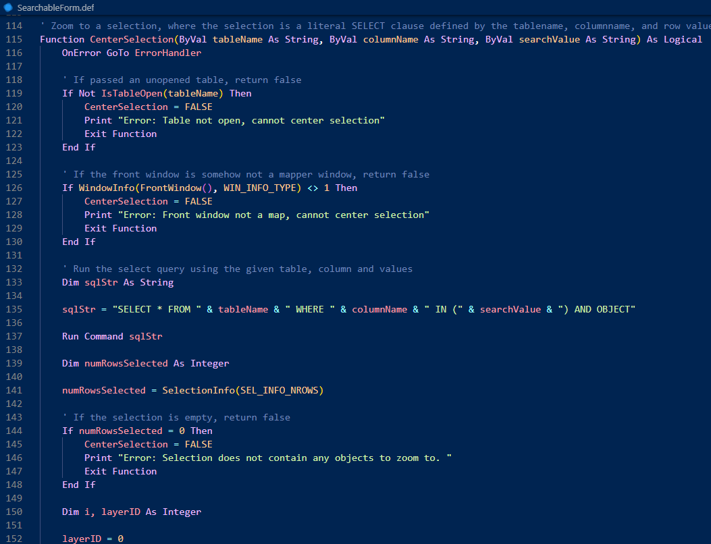
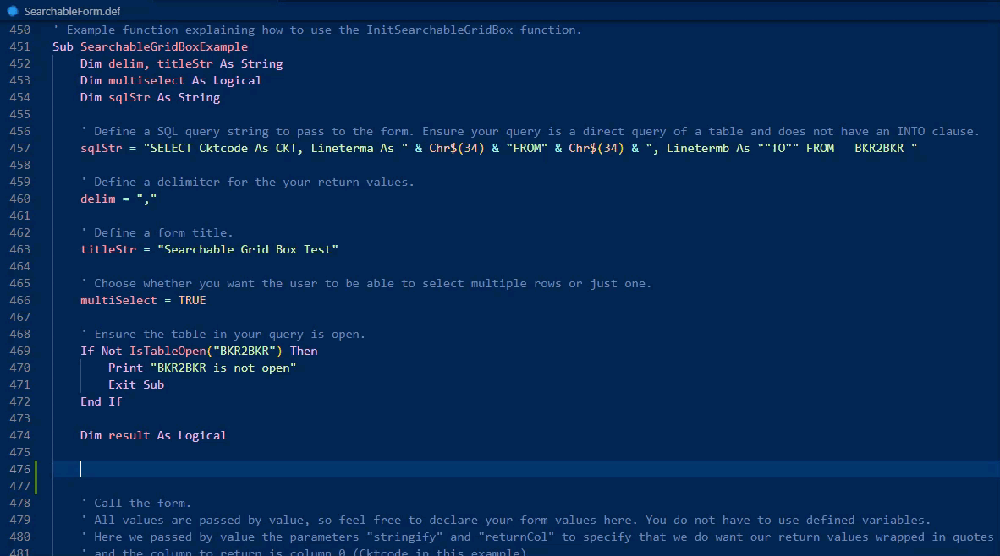

# MapBasic-Lang

Mapbasic-Lang is a Visual Studio Code lanaguage extension for the **MapBasic** language which includes syntax and semantic highlighting.

 Snippets exist for declaring ``Sub`` and ``Function`` blocks, declaring variables using ``Dim`` and ``Global``, as well as all of the standard flow control statements.

 

## Installation
You can install the MapBasic language extension from the [Visual Studio Code marketplace.](https://marketplace.visualstudio.com/items?itemName=JeremyCrain.mapbasic-lang)
